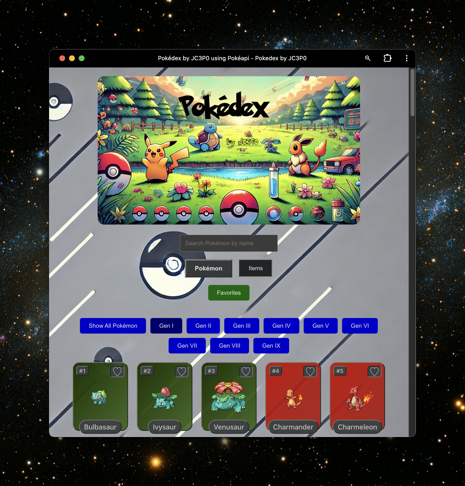
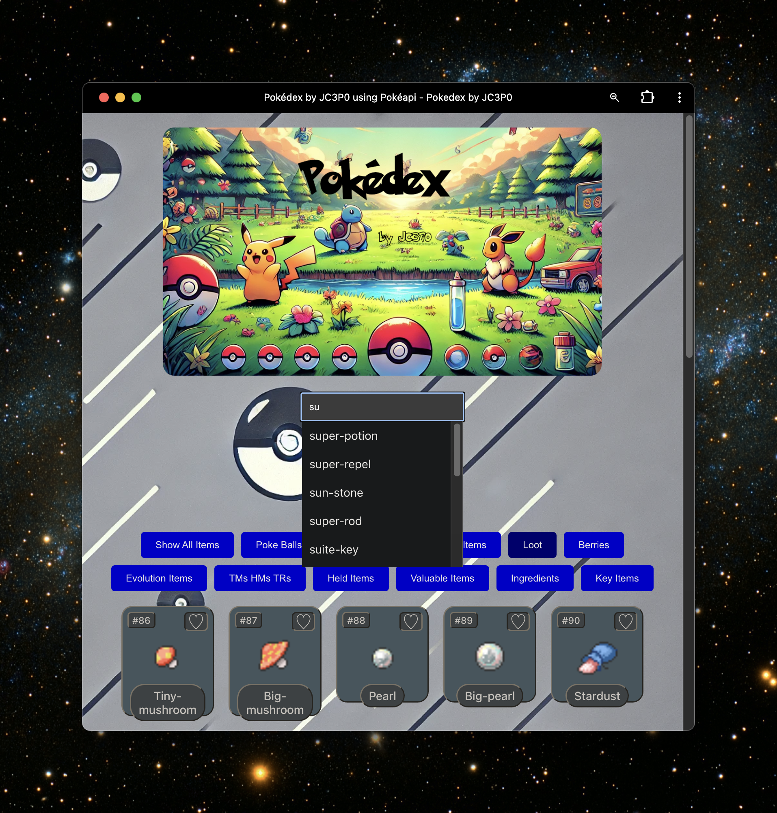
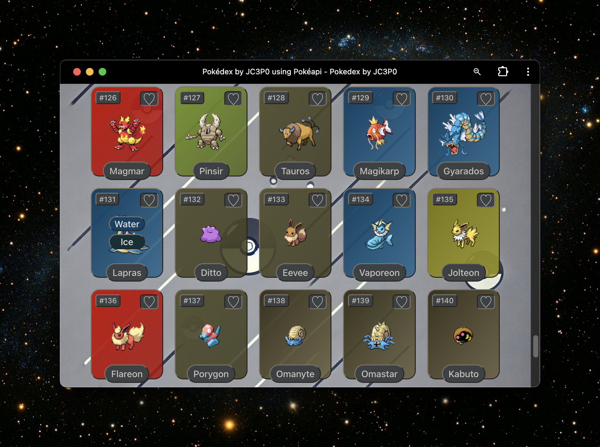
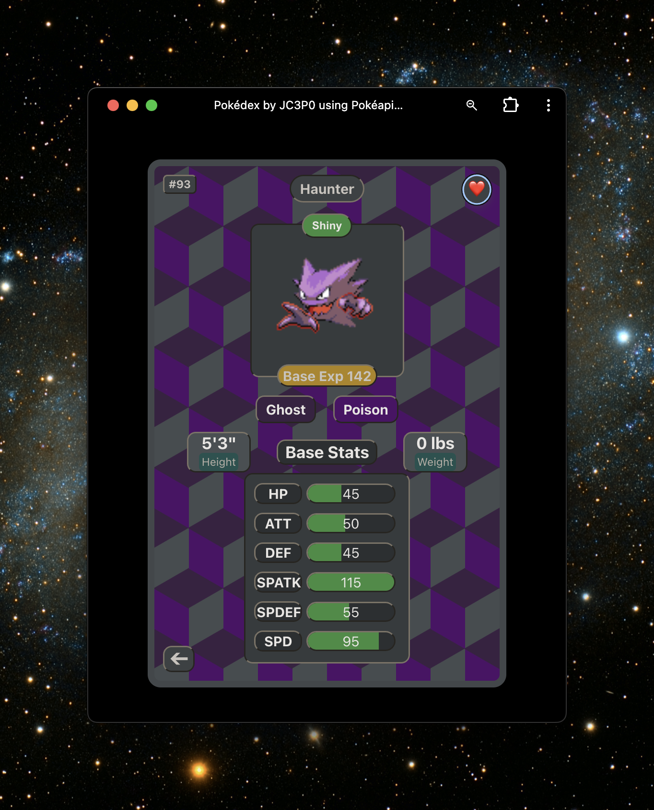
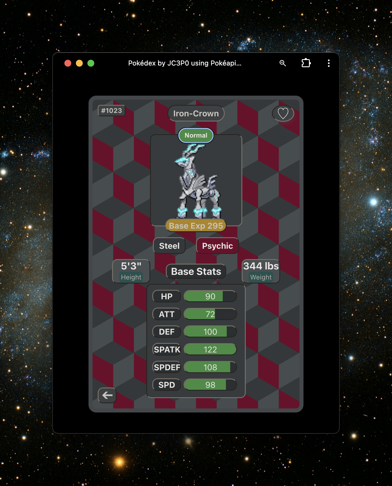
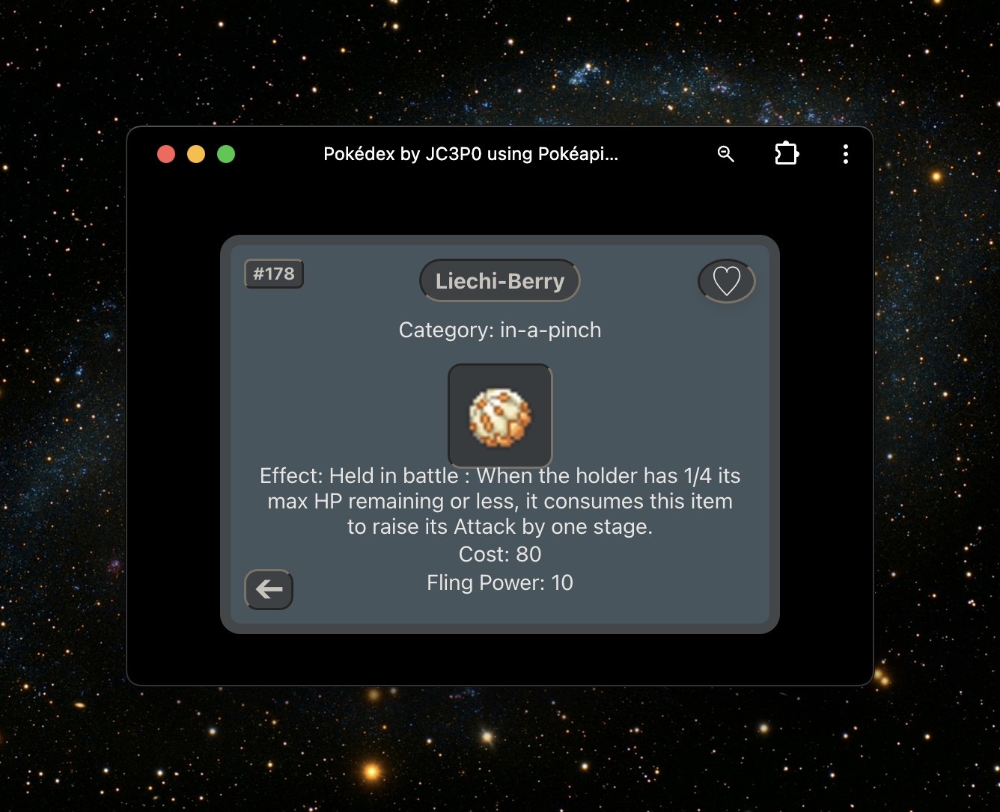
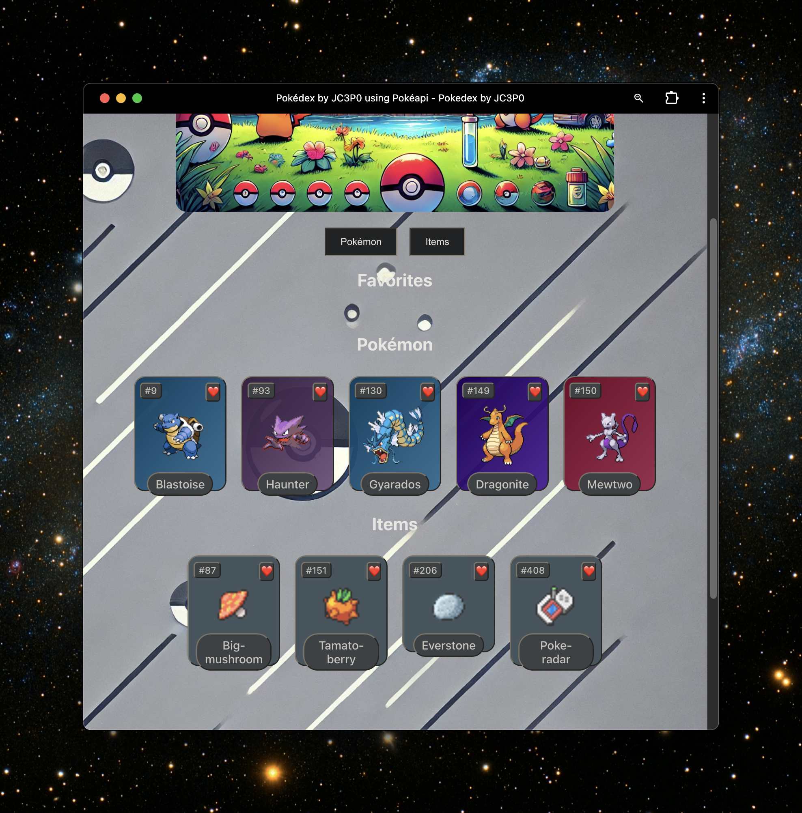

# Pokédex by JC3P0

The Pokédex by JC3P0 is a web application that serves as a comprehensive resource for Pokémon enthusiasts. Whether you're a seasoned trainer or a curious beginner, this app provides a wealth of information about Pokémon and their items in an intuitive, user-friendly format. Built using the MERN stack (MongoDB, Express.js, React, Node.js) along with JavaScript, HTML, and CSS, this app is designed with a focus on responsive design for all device types.

## Features
- View detailed information about Pokémon, including their stats, types, abilities, and more.
- View detailed information about items, including their category, cost, effect, and more.
- Dynamic search functionality for Pokémon and items by name.
- Manage a list of favorite Pokémon and items.
- Responsive design for optimal viewing on various devices.

## Screenshots

**Main Menu:**

**Dynamic Search:**

**Hover over pokemon to display their type(s):**

**Detailed Pokemon view:**

**Detailed item view:**

**Favorites view:**

**Demo:**

## License
This project is licensed under the MIT License.

## Acknowledgments
PokéAPI for providing the Pokémon data used in this project.
