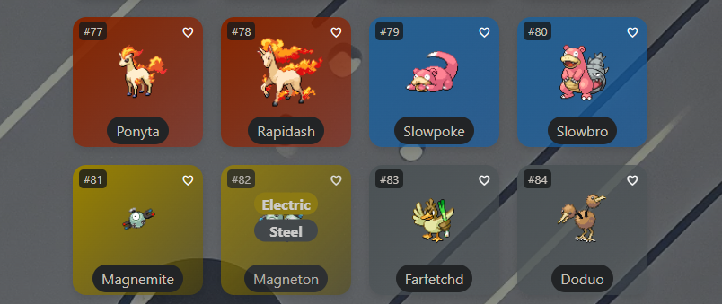
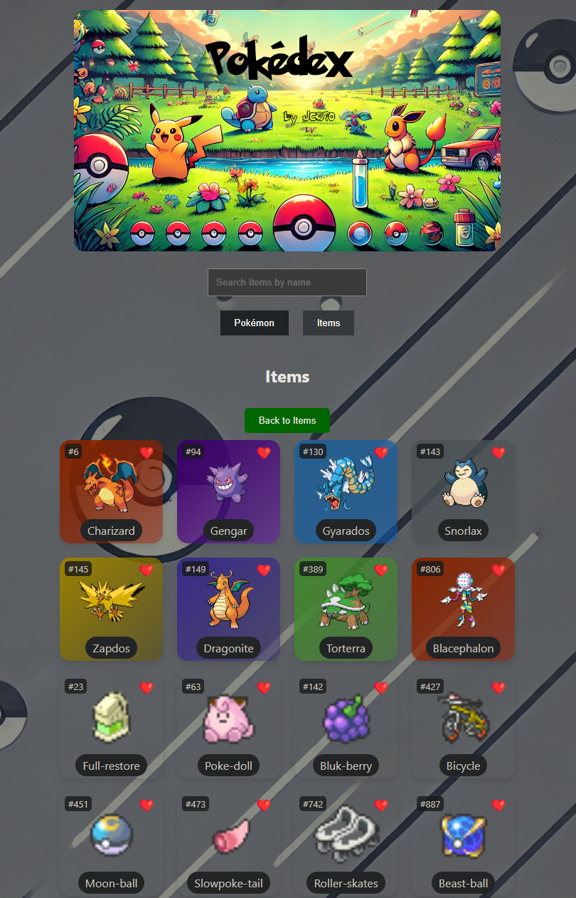

# Pokédex by JC3P0

## Table of Contents
- [Demo](#demo)
- [Overview](#overview)
- [Features](#features)
- [Tech Stack](#tech-stack)
- [Installation](#installation)
- [Usage](#usage)
- [Project Structure](#project-structure)
- [Screenshots](#screenshots)
- [License](#license)
- [Acknowledgments](#Acknowledgments)

## Demo
<video loop autoplay muted playsinline controls>
  <source src="screenshots/demo.mp4" type="video/mp4">
  Your browser does not support the video tag.
</video>

## Overview
The Pokémon Pokedex Web App is a full-stack application built using the MERN stack (MongoDB, Express.js, React, Node.js). It allows users to view detailed information about various Pokémon and items, search for specific Pokémon or items, and manage a list of favorites. The project demonstrates the ability to work with various technologies and provides a valuable educational tool for learning web development concepts.

## Features
- View detailed information about Pokémon, including their stats, types, abilities, and more.
- View detailed information about items, including their category, cost, effect, and more.
- Dynamic search functionality for Pokémon and items by name.
- Manage a list of favorite Pokémon and items.
- Responsive design for optimal viewing on various devices.

## Tech Stack
- **Frontend:**
  - React
  - JavaScript
  - HTML/CSS
- **Backend:**
  - Node.js
  - Express.js
  - MongoDB
- **Other Technologies:**
  - IndexedDB for client-side storage
  - Axios for API requests
  - Netlify for serverless functions

## Installation
1. Clone the repository:
   ```bash
   git clone https://github.com/JC3P0/Pokedex.git
2. Install server dependencies:
    cd server,
    'npm install'
3. Install client dependencies:
    cd ../client,
    'npm install'
4. Set up environment variables:
    Create a .env in server folder to include: DATABASE_URL=your_mongodb_connection_string
5. Start the development server:
    In the server directory:
        'node index.js'
    In the client directory:
        'npm start'

## Useage
1. Open your web browser and navigate to http://localhost:3000 to view the application.
2. Use the search bar to find Pokémon or items by name.
3. Click on a Pokémon or item to view detailed information.
4. Use the favorite buttons to add or remove Pokémon and items from your favorites list.

## Project Structure
    pokedex/
    │
    ├── client/
    │   ├── public/
    │   ├── src/
    │   │   ├── assets/
    │   │   ├── components/
    │   │   ├── utils/
    │   │   ├── App.js
    │   │   ├── index.js
    │   │   └── ...
    │   ├── package.json
    │   └── ...
    │
    ├── server/
    │   ├── models/
    │   │   ├── Item.js
    │   │   ├── Pokemon.js
    │   │   └── ...
    │   ├── routes/
    │   │   ├── items.js
    │   │   ├── pokemon.js
    │   │   └── ...
    │   ├── scripts/
    │   │   ├── fetchData.js
    │   │   └── ...
    │   ├── .env
    │   ├── index.js
    │   └── ...
    │   
    ├── package.json
    └── README.md

## Screenshots








## License
    This project is licensed under the MIT License.
    
## Acknowledgments
    PokéAPI for providing the Pokémon data used in this project.
